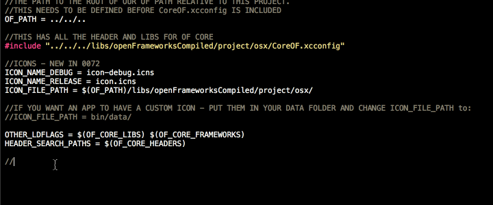
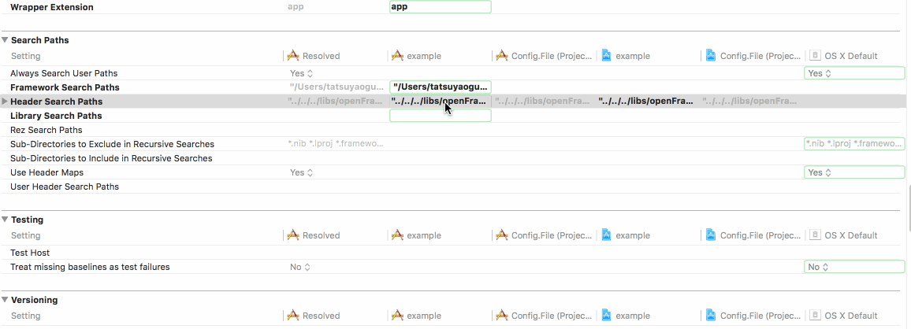

ofxEyeTribe
===========

An openFrameworks wrapper for [The Eye Tribe](https://theeyetribe.com/) SDK

# Installation

## Mac OSX

1. Install [Boost C++ libraries](http://www.boost.org/). Recommended version is 1.59.0, and use [Homebrew](http://brew.sh/).

2. Add Boost header files and linker files to your Xcode build settings. Looking for the config file `Project.xcconfig`, and write path to Boost root e.g. `BOOST_PATH = /usr/local/Celler/boost/1.59.0`.

3. Move to "Build Settings", looking for option "Header Search Paths", add Boost include path e.g. `$(BOOST_PATH)/include`.

4. Looking for option "Other Linker Flags", and add Boost libraries "libboost_thread-mt.a" and "libboost_system-mt.a" e.g. `$(BOOST_PATH)/lib/libboost_thread-mt.a`, `$(BOOST_PATH)/lib/libboost_system-mt.a`.

5. Start EyeTribe Searver (Application/EyeTribe/EyeTribe) on Terminal.

6. See example code for more details on how to use.

## Visual Studio

If you want use on Windows Visual Studio, please use EyeTribe library "GazeApiLib.lib" and Boost libraries, location is `libs/EyeTribeCppClient/lib/vs/x64` and `libs/boost/lib/vs/x64`. And add files in `libs/EyeTribeCppClient/include` to include paths, but remove files in `libs/EyeTribeCppClient/src` from compile list.

# Change Log

You can checkout for each version. See Tags in master branch.  

**Ver. 0.5**  

- Specification was reconstructed:
	- EyeTribe library for osx was removed. The API's source files will compile with your project build.
	- Boost libraries for osx were removed. Please add these yourself.
	- The functions for easy calibration `startCalibrationProcess` and `stopCalibrationProcess` were removed. That functions ware moved to example code. (please see `ofxEyeTribe/example`)

**Ver. 0.4**

- Fixed VS example project file (added cpp file, you have to "Release" build)
- Added some calibration functions

**Ver. 0.3**

- Supported Visual Studio 2015 x64 (Thank you [Matt](https://github.com/mattfelsen))

**Ver. 0.2**

- Imprementations were divided from ofxEyeTrive.h, (if you created a your original project include version 0.1 ofxEyeTribe, please add `ofxEyeTribe/src/ofxEyeTribe.cpp` to your project.)

**Ver. 0.1**

# Demo

https://vimeo.com/115662398

# Licensing

The Eye Tribe SDK is licensed under the BSD-style license found in the LICENSE file.
